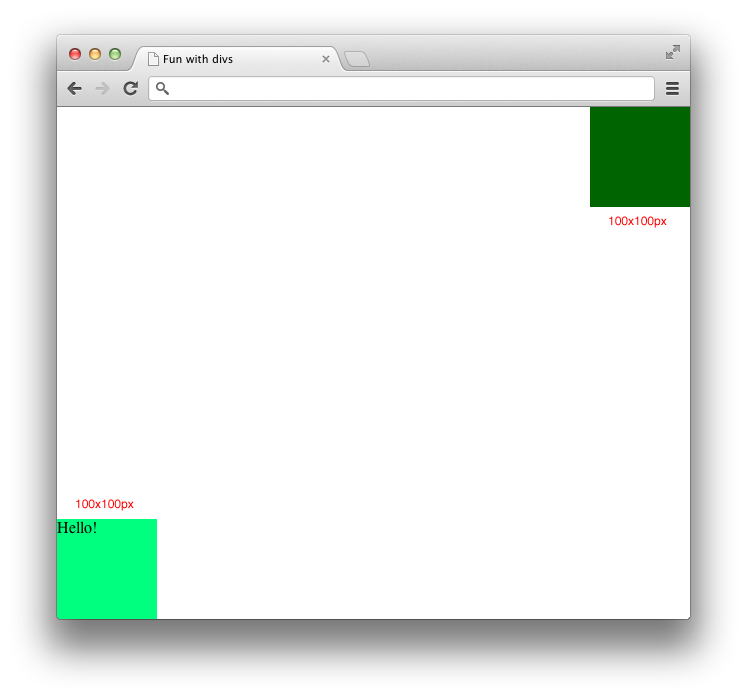

## Front-end Web Development
# Assignment for Week 18

Your job is to modify the `style.css` that goes along with [this site](assignment). You **cannot** change the HTML or `base.css`. Below are six different configurations that you should arrange the page into, along with annotations in red. The target amount of CSS properties you need to write are also listed - you can probably achieve the same effect with more properties, but try to write as little as possible. It's probably best to make six copies of the contents of the above file and work on each separately.

Number of properties: 4

* * *

Number of properties: 4

* * *

Number of properties: 1

* * *

Number of properties: 5 (four of which should be from the [micro clearfix hack](http://nicolasgallagher.com/micro-clearfix-hack/))

* * *

Number of properties: 3

* * *

Number of properties: 6

* * *

[Solution 1](http://jeffreyatw.github.io/fwd/series9/class18/solution1) [Solution 2](http://jeffreyatw.github.io/fwd/series9/class18/solution2) [Solution 3](http://jeffreyatw.github.io/fwd/series9/class18/solution3) [Solution 4](http://jeffreyatw.github.io/fwd/series9/class18/solution4) [Solution 5](http://jeffreyatw.github.io/fwd/series9/class18/solution5) [Solution 6](http://jeffreyatw.github.io/fwd/series9/class18/solution6)